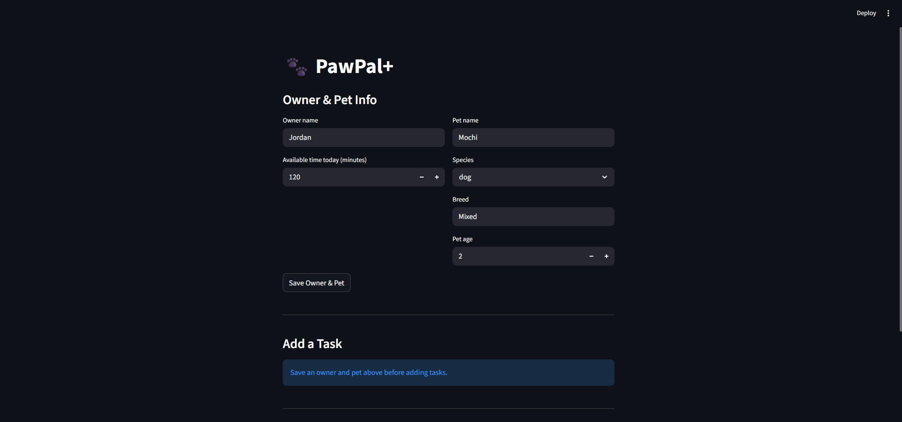

# PawPal+

**PawPal+** is a smart pet care scheduling app built with Python and Streamlit. It helps busy pet owners stay on top of daily care tasks by building a prioritized, conflict-free daily plan — and explaining every decision it makes.

---



---

## Features

### Owner & Pet Setup
Enter your name, how many minutes you have available today, and your pet's details (name, species, breed, age). The app creates a dedicated scheduler for your pet the moment you save.

### Task Management
Add any number of care tasks with full control over:
- **Name and type** — walk, feeding, meds, grooming, enrichment
- **Duration** — how many minutes the task takes
- **Priority** — HIGH, MEDIUM, or LOW
- **Start time** — picked with an AM/PM clock; the app automatically classifies the time slot (morning, afternoon, or evening)
- **Frequency** — daily, weekly, or as-needed

### Priority + Time Sorting
The scheduler sorts every task by **priority first** (HIGH → MEDIUM → LOW), then by **start time** as a tiebreaker within the same priority level. Tasks with no start time are always placed last. This ensures the most important tasks are always attempted first and the day flows in chronological order.

### Available Time Budget
The scheduler only adds tasks to the daily plan while they fit within the owner's available time. The moment a task would push the total over the limit, it is skipped and the reason is logged in the Scheduling Reasoning panel. Tasks whose combined duration exactly matches the budget are all included.

### Frequency Filtering
- **Daily** tasks are included every day
- **Weekly** tasks are only scheduled on Mondays
- **As-needed** tasks are never auto-scheduled — they require manual placement

Every skipped task is recorded in the reasoning log so you always know why something was left out.

### Real-Time Conflict Prevention
Before a task is saved, the app runs conflict detection. If the new task would introduce a problem, it is **rejected immediately** with a clear explanation — it is never added to the list. Two types of conflicts are caught:
- **Time window overlap** — two tasks whose start time + duration windows physically overlap, with the exact overlap in minutes reported
- **Slot overload** — tasks in the same time slot (morning / afternoon / evening) whose combined duration exceeds the 120-minute budget

### Daily Recurrence
Marking a task complete via the **Mark a Task Complete** panel automatically creates a fresh copy for the next occurrence — tomorrow for daily tasks, one week later for weekly tasks. The original completed task is preserved in history. As-needed tasks produce no renewal. The schedule table updates instantly to show ✅ Done.

### Schedule Display
After generating a plan the app shows:
- **Metric tiles** — tasks scheduled, total time used, tasks skipped
- **Sorted schedule table** — color-coded priority (🔴 HIGH, 🟡 MEDIUM, 🟢 LOW), start time in AM/PM format, live completion status
- **Scheduling Reasoning** — expandable panel showing why each task was included or skipped
- **Conflict Report** — expandable panel listing any remaining conflicts in the full task list

---

## Scenario

A busy pet owner needs help staying consistent with pet care. They want an assistant that can:

- Track pet care tasks (walks, feeding, meds, enrichment, grooming, etc.)
- Consider constraints (time available, priority, owner preferences)
- Produce a daily plan and explain why it chose that plan

---

## Testing PawPal+

### Running the tests

```bash
python -m pytest
```

To see detailed output for each test:

```bash
python -m pytest -v
```

### What the tests cover

The test suite in `tests/test_pawpal.py` contains 22 tests across four areas:

| Area | What is verified |
|---|---|
| **Sorting correctness** | Tasks are returned in chronological order; HIGH priority always comes before LOW; tasks with no `start_time` are placed last; time is used as a tiebreaker within the same priority level |
| **Recurrence logic** | Completing a daily task creates a new task due tomorrow; weekly tasks renew 7 days out; `as-needed` tasks produce no renewal; all original fields (name, duration, priority) are preserved on the renewed task |
| **Conflict detection** | Overlapping time windows are flagged with the exact overlap in minutes; touching tasks (no gap, no overlap) are not falsely flagged; slot overloads above 120 min are caught; duplicate task types in the same slot are reported; the exact-120-min boundary does not trigger a false overload |
| **Time budget** | Tasks that would exceed `available_time` are skipped and logged; a zero-minute budget produces an empty plan; tasks whose combined duration exactly equals the budget are all included |

### Confidence Level

★★★★☆ (4 / 5)

All 22 tests pass and cover the core scheduling behaviors, edge cases, and boundary conditions. One star is withheld because the test suite does not yet cover the Streamlit UI layer or multi-pet scheduling interactions, so end-to-end behavior in the app remains manually verified only.

---

## Getting started

### Setup

```bash
python -m venv .venv
source .venv/bin/activate  # Windows: .venv\Scripts\activate
pip install -r requirements.txt
```

### Suggested workflow

1. Read the scenario carefully and identify requirements and edge cases.
2. Draft a UML diagram (classes, attributes, methods, relationships).
3. Convert UML into Python class stubs (no logic yet).
4. Implement scheduling logic in small increments.
5. Add tests to verify key behaviors.
6. Connect your logic to the Streamlit UI in `app.py`.
7. Refine UML so it matches what you actually built.
